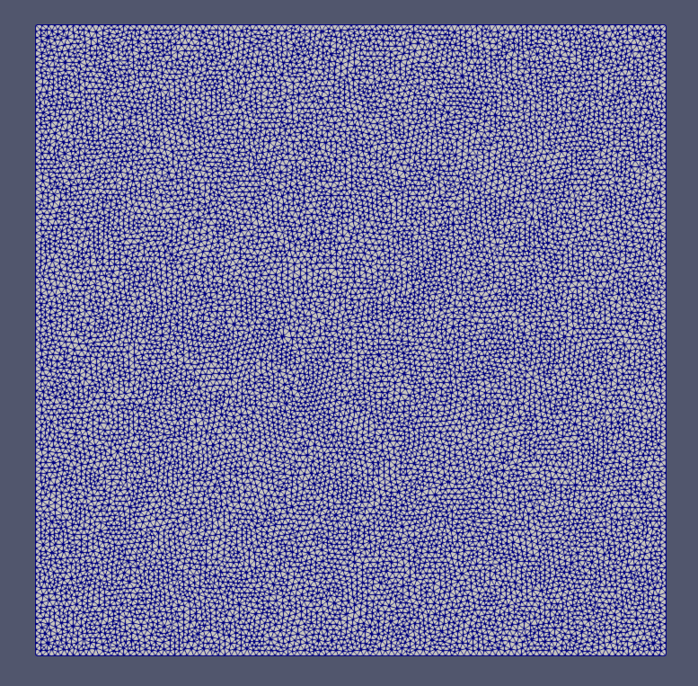
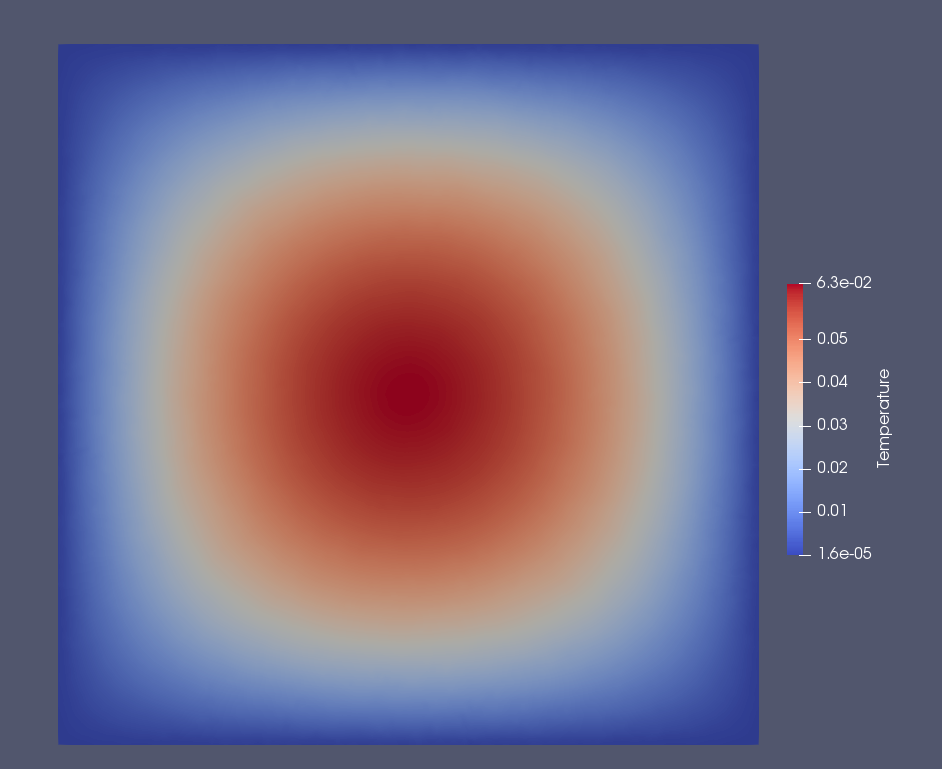
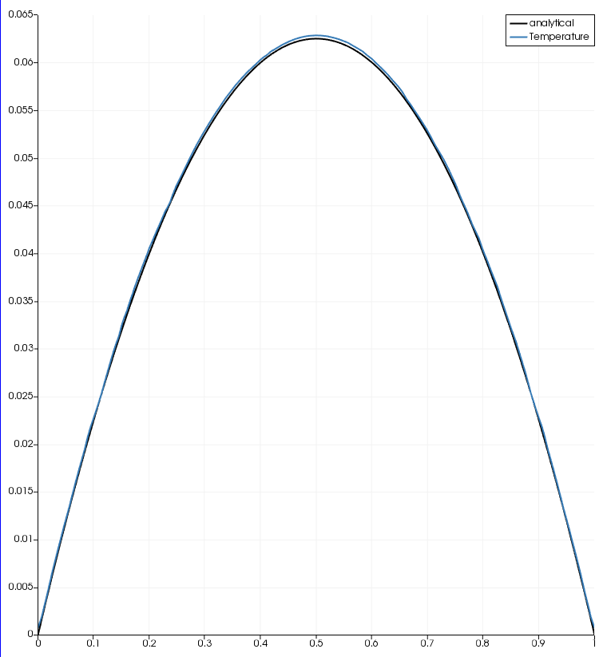

# Parallel Poisson Solver

## Mesh File Format Required

The solver uses a specific kind of mesh. 
The file should be named ```unstructured.grid``` or else, the code won't be able to recognize the mesh file.
If you use some other name, please make change in the ```readGrid.c``` file, and compile the code again.
The mesh format is specified below - 

```
n (Number of nodes)
(x-coordinate) (y-coordinate) (z-coordinate)
x1 y1 z1
x2 y2 z2
.  .  .
.  .  .
xn yn zn
c (Number of cells)
(Number of vertices for cell) (location of vertex 1 for given cell) (location of vertex 2 for given cell)
nv_1 n1_1 n2_1 n3_1
nv_2 n1_2 n2_2 n3_2
.    .    .    .
nv_n n1_n n2_n n3_n
f (Number of faces)
(location of vertex 1 for given face) (location of vertex 2 for given face) (location of cell 1 for given face) (location of cell 2 for given face) (boundary condition for given face)
n1_1 n2_1 c1_1 c2_1 bc_1
n1_2 n2_2 c1_2 c2_2 bc_2
.    .    .    .    .
n1_n n2_n c1_n c2_n bc_n
```

## Label for Boundary conditions

An additional file named ```input.in``` is required which lists the boundary conditions. The format of the input file should be as follows.
```
n(Number of BC)
BC_label1 BC_parameter1
BC_label2 BC_parameter2
...       ...
```
The label is of the format ```100x```,```200x```,```300x```,```400x``` where x represents the wall.
* ```100x``` represents the Dirichlet boundary condition for wall ```x```. Temperature has to be specified for this boundary condition.
* ```200x``` represents the homogeneous Neumann boundary condition for wall ```x```. Nothing needs to be specified for this boundary condition as it automatically takes 0 heat flux into account. Or in other words, it is an insulating boundary condition.
* ```300x``` represents the Neumann boundary condition for wall ```x```. Heat flux input or output has to be specified for this boundary condition.
* ```400x``` represents the mixed or Robin's boundary condition for wall ```x```. $h/k$ or convection coefficient / thermal conductivity, and the ambient temperature needs to be specified for this boundary condition.

## Compilation and Running the Code

The folder ```src``` contains the source code.
Compilation of source code is done with a makefile.
To compile the program, a C compiler is needed.
The code is tested with gcc version 8.2.0.
To compile the code, go to src folder and type

```
make
```

Once it is compiled, it will create an executable named ```poissonSolver```, copy that to the case directory, and run using the command

```
./poissonSolver
```

## Validation for Poisson Solver

The solution of the Poisson equation is assumed to be 

$
xy(1-x)(1-y)
$

So, the source term becomes

$
-2x + 2x^2 -2y + 2y^2
$

### Unstructured Mesh

<!--  -->


### Temperature contour

<!--  -->


### Comparison with the analytical solution

<!--  -->

